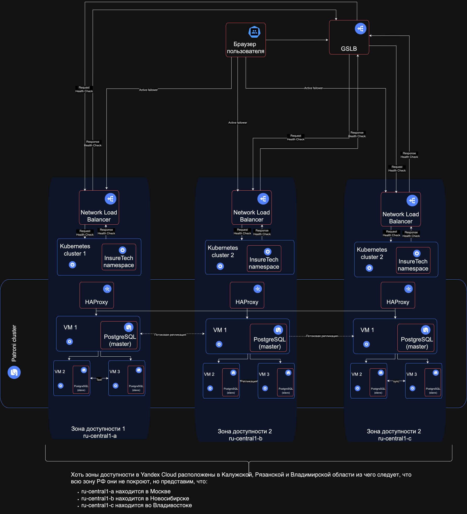

# Задание 1. Проектирование технологической архитектуры

Компания хочет сделать упор на развитие в регионах РФ. Планируется значительный рост количества пользователей и запросов. 

Нужно обеспечить бесперебойную работу сервиса 24/7, при этом сервис должен обслуживать клиентов из всех часовых поясов.

Требования к отказоустойчивости системы крайне высокие: RTO — 45 мин., RPO — 15 мин. Согласно требованиям бизнеса, доступность приложения должна быть равна 99,9%.

Дополнительно к этому нужно обеспечить одинаковое время загрузки страниц для пользователей из разных регионов. Оно не должно зависеть от географического местоположения пользователя.

На текущий момент сервис хранит ограниченный набор данных, который включает в себя:
* базовую информацию о клиентах — ФИО, контакты, документы,
* информацию о продуктах и тарифах,
* историю заявок клиентов.

Общий объём данных, которые хранятся в системе, равен 50 GB.

## Что нужно сделать
Необходимо спроектировать технологическую архитектуру приложения так, чтобы оно отвечало требованиям бизнеса.

Создайте схему итогового решения на основании текущей технологической архитектуры сервиса.

* Создайте новый документ в draw.io и назовите его «InureTech_технологическая архитектура_to-be». Работайте над первым заданием там. 
* Постарайтесь выдержать единый стиль оформления. Желательно, чтобы схема вашего решения была оформлена в той же нотации, что и схема текущей архитектуры. Для этого используйте библиотеки объектов Yandex Cloud. Ссылки на них мы дали в блоке «Как подготовиться к работе».
* При проектировании уделите внимание следующим аспектам:
  * Определите стратегию масштабирования и отказоустойчивости.
  * Рассмотрите вертикальное и горизонтальное масштабирование для вашей системы. 
  * Оцените, какая стратегия будет эффективнее. Требуется ли использование дополнительных зон безопасности?
  * Если приняли решение деплоить приложение в нескольких зонах безопасности, то продумайте и отразите на схеме следующие вопросы:
    1. Проработайте конфигурацию развёртывания приложения в Kubernetes. Вы будете использовать независимые кластеры в каждой площадке или один растянутый? Оставьте на схеме комментарий с объяснением, почему вы выбрали тот или другой подход.
    2. Спланируйте балансировку нагрузки. Опишите подход к балансировке нагрузки, который обеспечит распределение трафика между вашими сервисами и географически распредёленными серверами. Явно отразите на схеме все health check.
    3. Определите наиболее подходящую фейловер-стратегию. Она должна отвечать заданным требованиям отказоустойчивости. Отразите её на схеме на уровне взаимодействия клиента с приложением.
    4. Определите конфигурацию базы данных. Учитывая требования RTO и RPO, спроектируйте конфигурацию базы данных: определите, как вы будете обеспечивать репликацию данных и их резервное копирование. Если будете использовать конкретный фреймворк конфигурации кластера БД, отразите его на схеме.
  * Определите, будете ли вы применять шардирование БД. Отразите своё решение на схеме.
  * Когда будете сдавать задание, загрузите готовую схему в директорию Exc1 в рамках пул-реквеста.

## Решение
1. [Ссылка на схему](InsureTech_технологическая_архитектура_to-be.drawio.xml)
   
2. Стратегия масштабирования: горизонтальная. Использование HPA как сущность K8S для увеличения/уменьшения количества подов.
3. Стратегия отказойстойчивости: использование нескольких зон доступности, в данном случае выбраны зоны: ru-central1-a, ru-central1-b, ru-central1-c, но
    стоит учитывать, что эти зоны располагаются в Калужской, Владимирской и Рязанской областях, что не дает растянут на весь РФ, но мы
    представим, что зоны распределены на Москву, Новосибирск и Владивосток, чтобы учесть 3 зоны РФ. Это нам обеспечить изоляцию и независимость инфраструктуры.
4. Балансировщик: Network Load Balancer. Для распределения трафика между подами внутри namespace, а также выше стоит GSLB, который обеспечивает распределение трафика между
    географическими зонами.
5. Фейловер-стратегия: Active-Active. В каждой зоне должны быть открытые соединения, но если одна из зон доступности откажет, то трафик перейдет на рабочую зону. 
6. Конфигурация БД: Patroni. Для высокой доступности и отказоустойчивости распределённого кластера PostgreSQL.