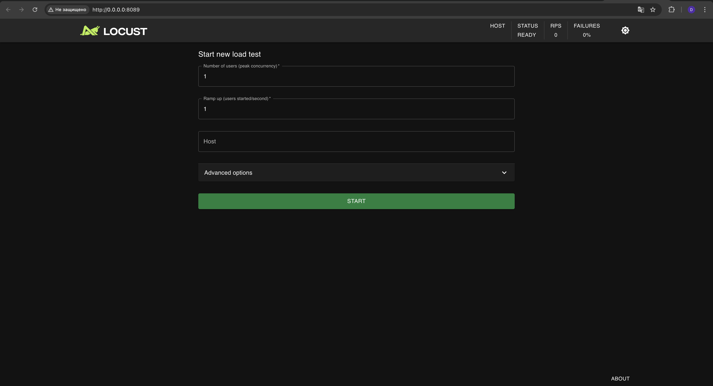
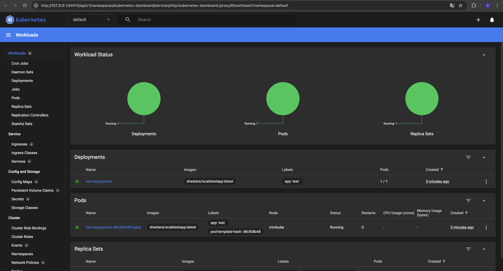
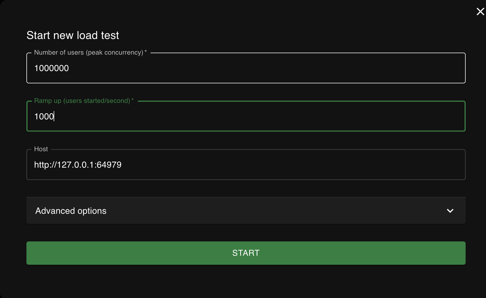
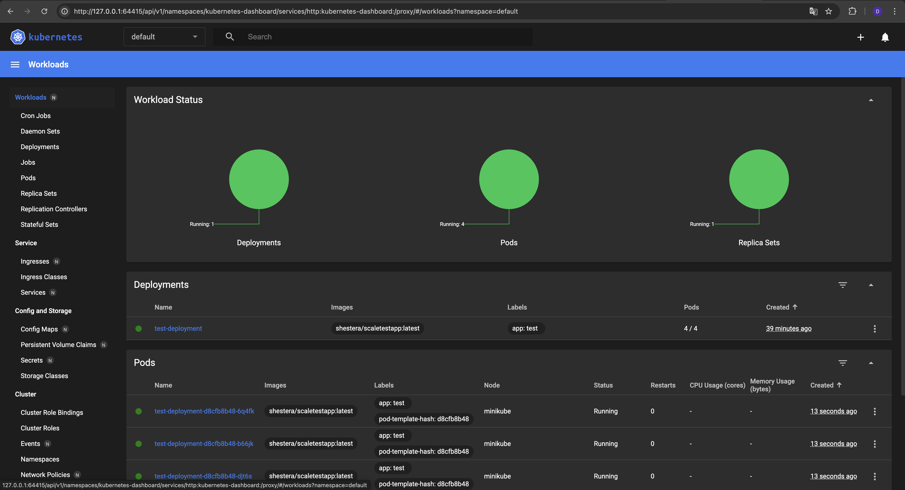

# Задание 2. Динамическое масштабирование контейнеров

Сейчас сервисы InsureTech развёрнуты в Kubernetes. Каждый из них развёрнут в определённом количестве экземпляров.

Обычно этих экземпляров достаточно для успешной обработки всех запросов. 

Но в периоды пиковой нагрузки система не справляется: она демонстрирует нестабильное поведение и постоянно перезагружает поды из-за нехватки памяти. 

Как следствие, пользователи получают негативный опыт работы с приложением. Бизнес видит, что NPS снижается.

Можно, конечно, держать больше реплик постоянно активными, чтобы система могла справиться с пиковыми нагрузками. Но это экономически невыгодно и приведёт к низким показателям утилизации ресурсов. Таким образом, вам необходимо решить проблему с помощью конфигурации динамического масштабирования для сервисов компании.

Вы будете тестировать динамическое масштабирование на примере простого приложения. Оно предоставляет два ресурса:
```
GET / — получение идентификатора пода;
GET /metrics — получение метрик в формате Prometheus.
```
Метрика `http_requests_total` возвращает количество запросов для метода получения идентификатора пода.

Образ тестового приложения. Оба метода приложения доступны по порту 8080.

🔍 Обратите внимание: в этом задании две части — одна обязательная, другая дополнительная.

Мы рекомендуем выполнить вторую часть, если вы хотите глубже разобраться в теме и получить опыт конфигурации кастомных метрик и горизонтального масштабирования на их основе. 

Главный плюс этой части в том, что эта задача ближе к реальной жизни и намного чаще встречается на практике, чем масштабирование на базе памяти и CPU.

Если у вас нет цели разобраться с кастомной конфигурацией метрик, можете пропустить дополнительное задание. Первой части достаточно, чтобы получить общее понимание механизма динамической маршрутизации.

## Обязательная часть задания: динамическая маршрутизация на основании показателей утилизации памяти

## Что нужно сделать

* Поднимите локальный кластер Kubernetes в Minikube.
* Активируйте metrics-server.
* Напишите манифест развёртывания (Deployment) Kubernetes для запуска тестового приложения.
  * Для начального количества реплик установите значение, равное единице. Лимит памяти установите равный “30Mi”. Примените написанную конфигурацию в вашем кластере. В рамках пул-реквеста добавьте файл в директорию Exc2.
* Напишите и примените манифест сервиса (Service) для доступа к приложению, которое вы установили на прошлом шаге. В рамках пул-реквеста файл с этим манифестом тоже загрузите в директорию Exc2.
* Настройте динамическую маршрутизацию на основании показателей утилизации оперативной памяти с помощью Horizontal Pod Autoscaler (HPA). Для нашего тестового приложения оптимальный уровень утилизации памяти равен 80%. В качестве максимального количества реплик рекомендуем установить 10. Примените манифест в вашем кластере. В рамках пул-реквеста загрузите готовый манифест в директорию Exc2.

`minikube service <имя сервиса> --url`

* Настройте динамическую маршрутизацию на основании показателей утилизации оперативной памяти с помощью Horizontal Pod Autoscaler (HPA). Для этого нужно активировать поддержку метрик в вашем кластере. Самый простой способ это сделать — воспользоваться командой:

`minikube addons enable metrics-server`

* Теперь создайте манифест для Horizontal Pod Autoscaler. Этот манифест будет автоматически масштабировать количество реплик вашего приложения в зависимости от роста потребления оперативной памяти (memory). Для нашего тестового приложения оптимальный уровень утилизации памяти равен 80%. В качестве максимального количества реплик рекомендуем установить 10. Примените манифест в вашем кластере. Загрузите готовый манифест в директорию Exc2 в рамках пул-реквеста.
* Теперь надо убедиться, что всё работает как задумано. Для этого необходимо сгенерировать нагрузку на приложение. Воспользуйтесь инструментом нагрузочного тестирования locust:

  * Создайте Locustfile. Это сценарий на Python, где вы определяете поведение пользователей. Создайте файл с именем locustfile.py в удобной для вас директории. Скопируйте туда код:
```
       from locust import HttpUser, between, task
 
       class WebsiteUser(HttpUser):
           wait_time = between(1, 5)
   
           @task
           def index(self):
               self.client.get("/") 
               
```
    
    
Этот пример создаёт класс пользователя, который переходит на главную страницу ("/") с интервалом между запросами от 1 до 5 секунд.
    
   * Откройте терминал и перейдите в директорию, где находится ваш locustfile.py. Выполните команду:

        `locust`

   * После запуска Locust откройте веб-браузер и введите адрес http://localhost:8089. Вы увидите веб-интерфейс Locust, где можно настроить параметры теста: количество пользователей и hatch rate — скорость, с которой генерируются новые пользователи.
   * Запустите тест и проанализируйте результаты. Проще всего посмотреть результаты в дашборде Kubernetes. В локальном кластере Minikube его можно открыть с помощью команды:

        `minikube dashboard`

   * Сделайте скриншоты дашборда или выгрузите логи, которые покажут, что количество реплик базы данных поменялось в ответ на сгенерированную нагрузку. Загрузите их в директорию Exc2 в рамках пул-реквеста.


## Решение

1. Запускаем minikube под М1 с помощью [stackoverflow](https://stackoverflow.com/questions/65397050/minikube-does-not-start-on-ubuntu-20-04-lts-exiting-due-to-guest-provision)
2. Активируем metrics-server: `minikube addons enable metrics-server`
3. Deployment: [link](deployment.yaml)
4. Service: [link](service.yaml)
5. HPA: [link](hpa.yaml)
6. Применяем манифесты:
   ```test
    daracvetkova@192-168-1-120 Exc2 % kubectl apply -f deployment.yaml 
    deployment.apps/test-deployment created
    daracvetkova@192-168-1-120 Exc2 % kubectl get po
    NAME                              READY   STATUS    RESTARTS   AGE
    test-deployment-d8cfb8b48-kq6ql   1/1     Running   0          5s
    daracvetkova@192-168-1-120 Exc2 % kubectl apply -f service.yaml
    service/test-srv created
    daracvetkova@192-168-1-120 Exc2 % kubectl get service
    NAME         TYPE        CLUSTER-IP     EXTERNAL-IP   PORT(S)    AGE
    kubernetes   ClusterIP   10.96.0.1      <none>        443/TCP    20h
    test-srv     ClusterIP   10.110.44.77   <none>        8080/TCP   11s
    daracvetkova@192-168-1-120 Exc2 % kubectl apply -f hpa.yaml    
    horizontalpodautoscaler.autoscaling/test-hpa created
    daracvetkova@192-168-1-120 Exc2 % kubectl get hpa          
    NAME       REFERENCE                    TARGETS         MINPODS   MAXPODS   REPLICAS   AGE
    test-hpa   Deployment/test-deployment   <unknown>/80%   1         10        0          4s
   ```
7. Создали [locustfile](locustfile.py)
8. Запустили:
    ```text
    daracvetkova@192-168-1-120 Exc2 % locust   
    [2025-01-01 13:04:45,590] 192-168-1-120/INFO/locust.main: Starting Locust 2.32.5
    [2025-01-01 13:04:45,590] 192-168-1-120/WARNING/locust.main: Python 3.9 support is deprecated and will be removed soon
    [2025-01-01 13:04:45,894] 192-168-1-120/INFO/locust.main: Starting web interface at http://0.0.0.0:8089
    ```
   Скриншот:
   

9. Запуск dashboard в k8s: `minikube dashboard`
    
10. Указываем в locust данные service:
    
11. Смотрим результаты в дашборде k8s:
    