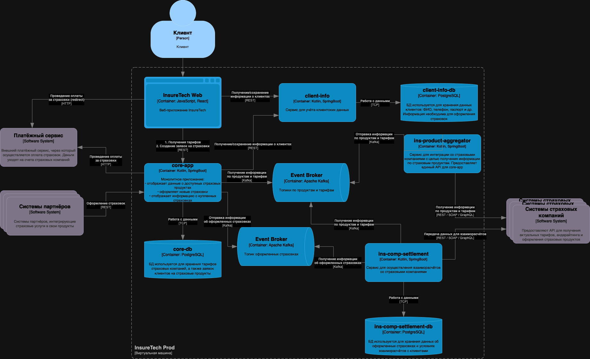

# Задание 3. Переход на Event-Driven архитектуру

Сервисы `core-app` и `ins-comp-settlement` получают данные о доступных продуктах через REST API сервиса `ins-product-aggregator`. 

В момент вызова он:
* запрашивает информацию из всех страховых компаний (сейчас их пять),
* агрегирует её в единый список,
* возвращает этот список в рамках того же синхронного запроса.

Чтобы ускорить работу сервисов, при изначальном проектировании команда решила хранить локальные реплики данных о продуктах и тарифах в сервисах core-app и ins-comp-settlement.

Сервис core-app осуществляет запрос к `ins-product-aggregator` раз в 15 минут, а ins-comp-settlement — раз в сутки (ночью), при формировании реестра оформленных страховок. Иногда команда сталкивается с ошибками взаимодействия между этими сервисами. Они связаны с задержками ответов или ошибками при взаимодействии с API страховых компаний.

Дополнительно сервис `ins-comp-settlement` раз в сутки осуществляет запрос в core-app по REST API для получения всех оформленных за день страховок. Эти данные он использует.

В ближайшее время InsureTech планирует подписать агентское соглашение ещё с пятью страховыми компаниями. Вам предстоит спроектировать решение, которое устранит текущие проблемы.

## Что нужно сделать

* Проанализируйте текущую архитектуру. 
* Создайте текстовый документ и напишите там список проблем и рисков, которые связаны с планируемым ростом нагрузки. Когда всё будет готово, загрузите документ в директорию Exc3 в рамках пул-реквеста.
* Обновите диаграмму контейнеров InsureTech, предложив решения для выявленных вами рисков и проблем. При этом:
  * Не меняя декомпозицию функциональности между сервисами, подумайте, какие взаимодействия стоит переделать на Event-Streaming.
  * Решите, будете ли вы использовать паттерн Transactional Outbox.
  * Когда схема будет готова, загрузите её в директорию Exc3 в рамках пул-реквеста.

## Решение

Список проблем и рисков, которые связаны с планируемым ростом нагрузки:
* Сервис одновременно запрашивает 5 внешних API в момент получения запроса. Это усложняет процесс ответа, так как мы движемся с темпом самого медленного участника.
* Ошибки в любом из сервисов могут привести к сбою всего запроса.
* При возникновении ошибок, похоже, приходится привлекать специалистов поддержки.
* Рекомендуется распределить этот процесс в течение дня и уменьшить зависимость сервисов друг от друга.

Какие взаимодействия переделаем на Event-Streaming?
  * Используем Kafka
  * Процессы:
    * Получение информации по продуктам и тарифам
    * Отправка информации об оформленных страховках
    * Получение информации об оформленных страховках

Паттерн Transactional Outbox можно использовать при получении/отправлении оформленных заявок, так как тут более повышенные требования к отказу или потери данным.

Схема:

[Ссылка на схему.](Exc3.drawio)