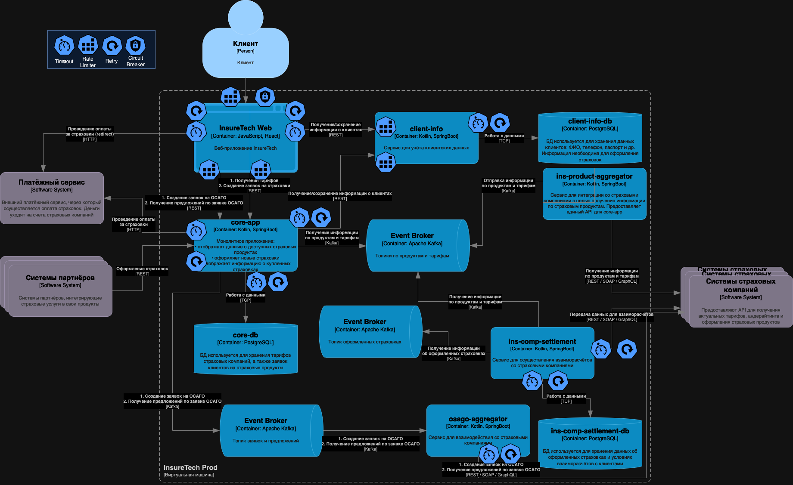

# Задание 4. Проектирование продажи ОСАГО

Компания планирует вскоре запустить новый продукт: оформление ОСАГО онлайн. 
Пользовательский путь выглядит так: 
* клиенту предлагается заполнить заявку с информацией о своём автомобиле, после этого сервис запрашивает у всех доступных страховых компаний предложения с условиями страхования под заявку клиента. 
* Бизнесу важно, чтобы на экране пользователя предложения от каждой страховой компании отображались сразу, как только от неё пришёл ответ. 
* Максимальное время ожидания решения от страховой компании — 60 секунд.

* Все страховые компании предоставляют однотипные REST API с двумя эндпоинтами:
  * создать заявку на ОСАГО,
  * получить предложение по заявке.
Бизнес предполагает, что в пик нагрузки количество одновременных пользователей, создающих заявку на ОСАГО, может достигать 2,5 тысячи человек.
  
Вы обсудили задачу с командой разработки и приняли такие решения:
  
* Сохранить подход, который использовался для получения данных о продуктах и тарифах из страховых компаний.
* Выделить отдельный сервис для взаимодействия со страховыми компаниями — osago-aggregator.
  
Функциональная обязанность этого сервиса — отправка заявок в страховые компании и дальнейший опрос решений по ним для передачи результатов в core-app. Остальная функциональность, связанная с оформлением ОСАГО, остаётся на стороне бэкенда в core-app.

Теперь вам нужно проработать ещё несколько моментов, исходя из требований бизнеса. 

Доработайте схему, которая у вас получилась в третьем задании. Отразите на ней ваши решения по этим вопросам: 

Проработайте реализацию osago-aggregator. Решите:
  * Требуется ли ему своё хранилище данных?
  * Какой API он предоставляет core-app?
  * Определите средство интеграции между сервисами core-app и osago-aggregator.
  * Подумайте над API для веб-приложения в core-app.
  * Определите средство интеграции между веб-приложением и core-app. Если будете использовать средство, отличное от REST, отразите интеграцию новой стрелкой.
  * В зависимости от выбранных средств интеграции подумайте, требуется ли где-то применение паттернов отказоустойчивости:
    * Rate Limiting,
    * Circuit Breaker,
    * Retry,
    * Timeout.
  * Отобразите применение паттернов на схеме с помощью обозначений из этой библиотеки.
  * Примите во внимание, что сервисы задеплоены в нескольких экземплярах. Подумайте, зависит ли ваше решение от этого.
  * Загрузите новый вариант схемы в директорию Exc4 в рамках пул-реквеста.

## Решение
1. Сервису osago-aggregator не требуется свое хранилище данных, так как данные все перегоняются в системы страховых компаний, дублирование на нашей стороне будет избыточным, в случае проблем можно взять данные из Kafka.
2. Отправка созданной/несозданной заявки, получение предложений от страховых сервисов.
3. osago-aggrerator и core-app общаются между собой через Event Broker - Kafka.

Схема:

[Ссылка на схему](Exc4.drawio)